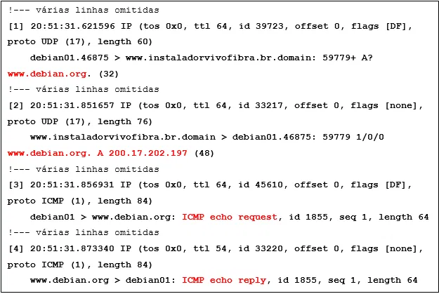
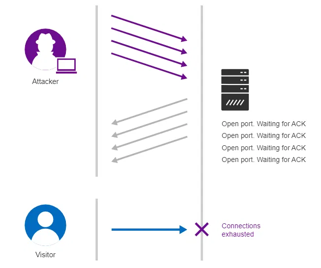
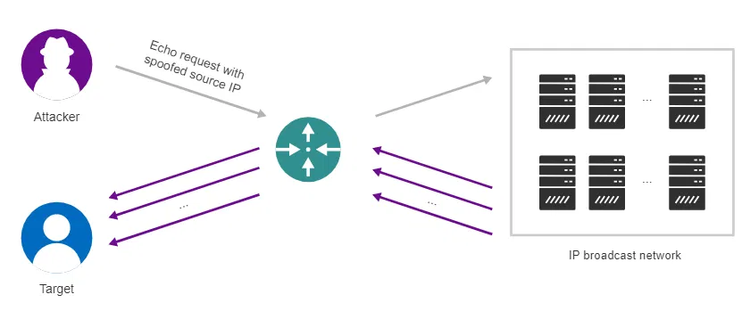

<h1 align="center">📝 Avaliação Oficial — Prova de Certificação: Cybersecurity</h1>

  <a href="../README.md">Home</a>
  &nbsp;&nbsp;&nbsp;|&nbsp;&nbsp;&nbsp;
  <a href="#-sobre-o-material">Sobre</a>
  &nbsp;&nbsp;&nbsp;|&nbsp;&nbsp;&nbsp;
  <a href="#-conteúdo-programático">Conteúdo</a>
  &nbsp;&nbsp;&nbsp;|&nbsp;&nbsp;&nbsp;
  <a href="#-questões-e-alternativas">Questões</a>
  &nbsp;&nbsp;&nbsp;|&nbsp;&nbsp;&nbsp;
  <a href="#-gabarito">Gabarito</a>
  &nbsp;&nbsp;&nbsp;|&nbsp;&nbsp;&nbsp;
  <a href="#-licença">Licença</a>

## 📖 Sobre o material

Este repositório reúne as **40 questões** da Prova de Certificação em **Cybersecurity**, organizadas para consulta e revisão. O objetivo é servir como material de estudo, agrupando enunciados, alternativas e o gabarito comentado por tema, cobrindo desde fundamentos de redes até segurança da informação, ataques, criptografia e testes de intrusão.

## 🏆 Resultado

| Item | Valor |
|---|---|
| **Nota final** | 90,00 / 100,00 |
| **Status** | ✅ Certificação concluída |
| **Tentativas permitidas** | 2 |
| **Tempo limite** | 3h20min |
| **Data de envio** | Domingo, 16 de agosto de 2026 |
| **Período de disponibilidade** | 01/03/2020 a 31/12/2050 |

## 🖼️ Certificado

---

## 📚 Conteúdo programático

O conjunto de questões abrange os seguintes eixos temáticos:

1. **Fundamentos de Redes**
   - Modelo TCP/IP e correspondência com o modelo OSI
   - Protocolos de aplicação (HTTP, FTP, SMB)
   - Análise de tráfego (TCPDump, SPAN/port mirroring)

2. **Criptografia**
   - Conceitos de cifragem e decifragem
   - Algoritmos simétricos (DES)
   - Funções hash e assinatura digital
   - Certificado digital

3. **Ataques e Ameaças**
   - Ataques de negação de serviço (SYN Flood, Smurf, Fraggle)
   - Ataques passivos, ativos e de força bruta
   - Engenharia social (Phishing, Dumpster Diving)

4. **Segurança da Informação**
   - Pilares da segurança (Confidencialidade, Integridade, Disponibilidade)
   - Conceitos de risco, evento, incidente e vulnerabilidade
   - Políticas de segurança (adesão, imposição, whitelisting)

5. **Testes de Intrusão**
   - Scanners de vulnerabilidade
   - Abordagens Black Box, White Box e Gray Box
   - CERT.br e resposta a incidentes

---

## 📝 Questões e Alternativas
 
### Questão 1 — Modelo TCP/IP
Quais são as 4 camadas componentes do TCP/IP?
 
- a. Aplicação, transporte, Internet e enlace.
- b. Aplicação, apresentação, sessão e transporte.
- c. Aplicação, transporte, Internet e acesso à rede.
- d. Aplicação, transporte, sessão e enlace.
- e. Aplicação, Internet, enlace e acesso à rede.
### Questão 2 — Criptografia
A criptografia é uma das técnicas mais eficazes e difundidas para garantia da confidencialidade por meio da cifragem da mensagem, tornando-a, desta forma, inicialmente, ilegível. Analise as afirmações a seguir:
 
I. Criptografar (também, muitas vezes, referenciado como encriptar), processo de submissão da mensagem em clear text a um algoritmo específico que a codifica, tornando-a incompreensível.
II. Decriptografar (também, muitas vezes, referenciado como desencriptar), reversão do processo de criptográfico, restaurando a legibilidade e compreensão da mensagem original.
III. Clear text o texto claro, explícito, com o qual a mensagem foi originalmente cunhada.
IV. Texto cifrado ou mensagem cifrada, como o resultado produzido pela submissão da mensagem ao algoritmo criptográfico.
 
Sobre criptografia, quais as afirmações acima estão corretas?
 
- a. I, II e III.
- b. I, II, III e IV.
- c. I, III e IV.
- d. I e II.
- e. II e IV.
### Questão 3 — Scanner de Vulnerabilidades
Existe uma infinidade de ferramentas destinadas à execução de testes de intrusão, indo de ferramentas nativas do próprio sistema operacional a ferramentas especializadas, como scanners de portas e de vulnerabilidades. Uma delas é o scanner de vulnerabilidades (vulnerability scanners). Escolha a opção correta sobre essa ferramenta:
 
- a. É uma ferramenta destinada a promover uma varredura das portas do alvo a fim de identificar seus estados e, eventualmente, extrair informações complementares, como, por exemplo, o nome e versão da aplicação que disponibiliza determinado serviço.
- b. Scanner de vulnerabilidades não é uma ferramenta de teste de intrusão.
- c. É uma ferramenta que detecta invasores na rede, bloqueando-os sempre que necessário.
- d. É uma ferramenta destinada à busca de pontos vulneráveis no alvo indicado, como, por exemplo, senhas-padrão, serviços inseguros ouvindo em portas bem conhecidas ou ainda falhas e exposições comuns.
- e. É uma ferramenta de Validação Automática de acessibilidade e obtenção de privilégios.
### Questão 4 — Análise de tráfego com TCPDump
Quando colocamos o TCPDump em execução a partir de um usuário regular, é enviado um pacote ICMP ao site do DEBIAN (www.debian.org), obtendo-se do TCPDump a resposta sintetizada na figura a seguir. Analise as afirmações:
 

  

I. Um datagrama IP foi enviado pelo host debian01 ao host www.instaladorvivofibra.com.br solicitando o endereço IPv4 do host www.debian.org.
II. O host www.instaladorvivofibra.com.br responde ao host debian01 que o endereço IPv4 do host www.debian.org é 200.17.202.197.
III. O host debian01 envia ao host www.debian.org outro datagrama IP, com uma mensagem ICMP tipo echo-request (seq 1).
IV. O host www.debian.org responde à mensagem do host debian01 enviando outro datagrama IP, com uma mensagem ICMP tipo echo-reply (seq 1).
 
Quais afirmações estão corretas?
 
- a. II e IV.
- b. I e III.
- c. II, III e IV.
- d. I e II.
- e. I, II, III e IV.
### Questão 5 — Políticas de segurança contra engenharia social
Em ambientes corporativos, as políticas de segurança constituem importante instrumento para a prevenção das ações dos engenheiros sociais. Dentre as principais recomendações, destacam-se:
 
I. Não envie informações confidenciais pela Internet antes de verificar a segurança de um site.
II. Instale e mantenha software antivírus, firewalls e filtros de e-mail para reduzir parte desse tráfego.
III. Verifique a URL dos sites. Sites maliciosos podem parecer idênticos a um site legítimo, mas a URL pode usar uma variação na ortografia ou em um domínio diferente (por exemplo, .com vs. .net).
IV. Aproveite os recursos de phishing oferecidos por seu cliente de e-mail e por seu navegador web.
 
Quais recomendações estão corretas?
 
- a. I, II e III.
- b. Todas estão corretas.
- c. II, III e IV.
- d. I e II.
- e. Somente I.
### Questão 6 — Motivações para análise de pacotes
A análise de pacotes em uma rede (análise de tráfego) tem diferentes motivações. Dentre outras, pode-se apontar como principais razões que justificariam a análise de pacotes em uma rede, **exceto**:
 
- a. A implementação de um plano de contingência e emergência.
- b. A verificação do tráfego gerado por protocolo.
- c. A verificação da existência de gargalos na rede.
- d. A implementação de políticas de segurança.
- e. O correlacionamento de eventos.
### Questão 7 — Ambientes seguros e restrição de privilégios
Por que dizemos que quanto mais seguro um ambiente, mais "engessado" ele é?
 
- a. Para se evitar engessar o sistema, devemos aumentar os privilégios dos usuários não nos preocupando tanto com a segurança excessiva do ambiente.
- b. Devido à impossibilidade de se efetuar manutenções corretivas.
- c. Porque as pessoas (usuários) têm um conhecimento menor sobre o sistema de trabalho.
- d. Porque não conseguimos efetuar uma análise de riscos de maneira clara e seguindo as orientações da ISO 27000.
- e. Devido à manutenção dos privilégios, onde um usuário comum não tenha privilégios de administrador, como instalar um software, por exemplo.
### Questão 8 — SPAN (Switched Port Analyzer)
Qual a opção INCORRETA em relação ao conceito de SWITCHED PORT ANALIZER?
 
- a. Tem como função estabelecer conexões fim a fim entre o host de origem e o host de destino, com base nos respectivos endereços MAC, o que, em princípio, impossibilita a captura de pacotes por um terceiro host.
- b. Pode ser descrito como uma funcionalidade dos switches gerenciáveis que copia os pacotes que entram ou saem por uma porta do equipamento, enviando estas cópias à outra porta previamente configurada.
- c. É importante salientar a relevância do espelhamento de portas para viabilizar a análise de tráfego em redes comutadas (baseadas em switches) uma vez que estes dispositivos são nativos da camada de sessão do modelo OSI.
- d. Uma das melhores formas para obtenção de amostras do tráfego da rede e, também, conhecido como port mirroring.
- e. Podem ser conectadas aplicações específicas, tais como analisadores de tráfego e de protocolos.
### Questão 9 — Ataque SYN Flood
As conexões TCP são estabelecidas por intermédio de um processo denominado 3-Way Handshake. Neste tipo de ataque, o último ACK nunca é enviado pelo atacante, que continua inundando o alvo com novas requisições de conexão sem estabelecê-las, exaurindo a capacidade do alvo de atender novas requisições. Que tipo de ataque é esse, representado pela figura abaixo?
 

  

- a. Ataque Fraggle.
- b. Ataque por SYN Flood.
- c. Ataque por ICMP Redirect.
- d. Ataque Smurf.
- e. Ataque de força bruta.
### Questão 10 — Camada OSI dos serviços de rede
Em uma rede de computadores, os serviços disponíveis, como e-mail, de diretório (Directory Services) e compartilhamento local de arquivos, são disponibilizados aos computadores clientes quando necessário. Cada um desses serviços é implementado por um ou mais protocolos específicos disponíveis em qual camada do modelo OSI?
 
- a. Apresentação.
- b. Transporte.
- c. Sessão.
- d. Rede.
- e. Aplicação.
### Questão 11 — Tipos de ataque: negação de serviço
"São ataques que interferem no funcionamento dos sistemas e serviços, prejudicando usuários e dispositivos de rede." De que tipo de ataque estamos nos referindo?
 
- a. Ataques de paralisação ou negação de serviço.
- b. Ataques por repetição.
- c. Ataques por aumento de privilégios.
- d. Ataques passivos ou de reconhecimento.
- e. Ataques ativos ou de comprometimento.
### Questão 12 — CERT.br
Qual a maior responsabilidade do CERT.br, que é o Grupo de Resposta a Incidentes de Segurança para a Internet brasileira, mantido pelo NIC.br, do Comitê Gestor da Internet no Brasil?
 
- a. Produzir as estatísticas que são fontes de informação confiáveis e atualizadas para somente as grandes empresas.
- b. Atuar como ponto central para notificações de acidentes de segurança no Brasil.
- c. Realizar o tratamento dos computadores que envolvam redes conectadas à Internet brasileira.
- d. Realizar o tratamento dos incidentes de segurança em computadores que envolvam redes conectadas à Internet brasileira.
- e. Envolver todos os computadores às redes conectadas à Internet brasileira.
### Questão 13 — Investimentos em Cybersecurity
As empresas têm consciência do problema causado por ataques cibernéticos aos seus negócios e estão tomando as medidas necessárias para mitigar riscos e garantir a continuidade de negócio. Segundo estudo da Cyber Security Insights, é correto afirmar que:
 
- a. A implementação da Lei Geral de Proteção de Dados não altera os planos para coleta e utilização dos dados de clientes e colaboradores.
- b. O investimento na área de Segurança da Informação até o ano de 2021 será de U$ 6 trilhões.
- c. Nas grandes empresas os planos de investimento na área de Segurança da Informação serão de U$ 1 bilhão.
- d. As tentativas de pessoas não autorizadas para obter acesso a estes sistemas só acontecem em grandes empresas.
- e. Somente as grandes empresas terão planos de Cybersecurity em 2021.
### Questão 14 — Leet Speak
Para que a estruturação de uma senha seja fácil de se lembrar, uma das recomendações é a criação de padrões pessoais de substituição de caracteres, por exemplo, tendo como base a semelhança visual ("w" e "vv") ou fonética ("ca" e "k") entre os caracteres. A essa analogia ao "alfabeto hacker" damos o nome de:
 
- a. Kirk.
- b. Geek.
- c. ASCII.
- d. Leet.
- e. Switch.
### Questão 15 — Phishing
Tipo de fraude na qual um golpista tenta obter dados pessoais e financeiros de um usuário, por meio do uso combinado de meios técnicos e engenharia social. É praticada por meio do envio de mensagens eletrônicas que:
 
I. Tentam se passar pela comunicação oficial de alguma instituição conhecida como um banco, uma empresa ou um site popular.
II. Procuram atrair a atenção do usuário, aguçando sua curiosidade, apelando à sua caridade ou ainda oferecendo a possibilidade de vantagens financeiras, entre outras possibilidades.
III. Advertem que o não atendimento aos procedimentos solicitados poderá ter sérias implicações, como, por exemplo, a inscrição em serviços de proteção ao crédito ou o cancelamento de um cartão de crédito.
 
De qual tipo de fraude estamos nos referindo?
 
- a. Pretexting.
- b. Phishing.
- c. Gift giving.
- d. Baiting.
- e. Identity theft.
### Questão 16 — DoS/DDoS
"São os que têm como objetivo desabilitar ou impedir o funcionamento de sistemas em produção, sendo normalmente referidos pelas siglas DoS (Denial of Service), ou DDoS (Distributed Denial of Service) quando o ataque é implementado de forma distribuída." De que tipo de ataque estamos nos referindo?
 
- a. Ataques por repetição.
- b. Ataques de paralisação ou negação de serviço.
- c. Ataques por aumento de privilégios.
- d. Ataques ativos ou de comprometimento.
- e. Ataques passivos ou de reconhecimento.
### Questão 17 — Protocolo SMB
O SMB é o protocolo utilizado pela Microsoft para compartilhamento de arquivos e impressoras em redes Windows. Analise as afirmações sobre esse protocolo:
 
I. No Windows Server 2012, o protocolo SMB está em sua versão 3, e de acordo com a Microsoft, entre outras melhorias, destaca-se a criptografia ponta a ponta, evitando a intercepção do tráfego em redes não confiáveis.
II. A versão 1 do protocolo SMB é extremamente vulnerável e utilizada pelo WannaCry para atacar os sistemas dos usuários, devendo, portanto, ser desabilitada.
III. As distribuições Linux implementam o SMB por intermédio do servidor SAMBA e, desta forma, conseguem integrar-se perfeitamente às redes Windows.
 
Quais afirmações acima são corretas?
 
- a. Todas são corretas.
- b. II e III são corretas.
- c. Todas são incorretas.
- d. Somente III é correta.
- e. I e II são corretas.
### Questão 18 — Dumpster Diving
Na fraude conhecida como Dumpster Diving, o engenheiro social:
 
- a. Tenta se passar por outra pessoa.
- b. Realiza falsas pesquisas, nas quais alvos, específicos ou não, respondem a questionários em troca de brindes.
- c. Sem credenciais adequadas, segue uma pessoa autorizada ao adentrar uma área restrita.
- d. Procura informações e inspeciona o conteúdo do lixo do alvo.
- e. Espia por cima do ombro quando alguém preenche um formulário ou digita a respectiva senha no computador.
### Questão 19 — Camada de acesso à rede (TCP/IP)
Os protocolos desta camada fornecem os meios para que o sistema entregue dados a outros dispositivos diretamente conectados à rede. Além disso, essa camada define como usar a rede para a transmissão de datagramas IP. De que camada TCP/IP estamos falando?
 
- a. Camada de Internet.
- b. Camada de transporte.
- c. Camada de acesso à rede.
- d. Camada de aplicação.
- e. Camada de enlace.
### Questão 20 — Conceito de ataque cibernético
A crescente preocupação expressada por diferentes especialistas em relação à necessidade de proteção dos sistemas de informação contra os ataques cibernéticos pode ser definida como?
 
- a. Aplicação de uso de ferramentas para obter acesso aos locais nos quais estão mantidos os servidores.
- b. Destruição não autorizada de tipos de ações danosas ou legais.
- c. Apenas uma crescente preocupação.
- d. Tentativas de pessoas autorizadas para obter acesso a estes sistemas.
- e. Tentativas de pessoas não autorizadas para obter acesso a estes sistemas.
### Questão 21 — Certificado digital
O certificado digital (que é a identidade digital da pessoa física ou jurídica no meio eletrônico) garante quais elementos em relação à manipulação e garantia da segurança das informações?
 
- a. Os pilares básicos da Segurança da Informação (CID).
- b. Autenticidade, confidencialidade, integridade e não repúdio.
- c. Autenticidade, confidencialidade, integridade e repúdio.
- d. O certificado digital não garante a segurança das informações.
- e. Apenas confidencialidade por meio da criptografia.
### Questão 22 — Conceito de risco
Qualquer evento que possa ter impacto (negativo) sobre a capacidade da empresa de alcançar seus objetivos de negócio, ou ainda, como a combinação da probabilidade de ocorrência de um evento e suas consequências. Esse é o conceito básico de qual elemento?
 
- a. Risco.
- b. Evento.
- c. Vulnerabilidade.
- d. Incidente.
- e. Impacto.
### Questão 23 — Conceito de incidente
Um único, ou uma série, de eventos de segurança indesejados, ou inesperados, com possibilidades reais de comprometer o fluxo de negócio e ameaçar a segurança da informação. Esse é o conceito básico de qual elemento?
 
- a. Evento.
- b. Risco.
- c. Incidente.
- d. Impacto.
- e. Vulnerabilidade.
### Questão 24 — Whitelisting em firewalls
Sobre políticas de acesso de um sistema de filtragem de pacotes, o que deve ser bloqueado?
 
- a. Parte-se do pressuposto que, por padrão, tudo deverá ser bloqueado, liberando-se o estritamente determinado pelas políticas de segurança, prática esta conhecida como whitelisting.
- b. Tudo, todo o sistema deve ser bloqueado a qualquer momento, não permitindo o acesso de qualquer usuário.
- c. Algumas pastas do sistema.
- d. Deve-se bloquear somente as redes sociais.
- e. Nada, todo o sistema deve ser liberado para que o usuário acesse todos os seus componentes.
### Questão 25 — Conceito de evento
Ocorrência em um sistema, serviço ou estado da rede que aponte para uma possível violação da política de segurança da informação, falha de controles ou uma situação inusitada que pode ser relevante para a segurança. Esse é o conceito básico de qual elemento?
 
- a. Incidente.
- b. Evento.
- c. Risco.
- d. Impacto.
- e. Vulnerabilidade.
### Questão 26 — ISO/IEC 27001 (CID)
Segundo a ISO/IEC 27001:2005, a proteção da informação pode ser inicialmente entendida como a preservação da confidencialidade, integridade e disponibilidade da informação. Diante disso, analise as afirmações:
 
I. Confidencialidade da informação significa que ela deverá ser revelada, ou estar acessível, unicamente aos que tiverem autorização para tal.
II. A Integridade é a propriedade que garante a exatidão e plenitude da informação, o que não significa que ela não possa sofrer alterações ao longo de seu ciclo de vida, mas, sim, que tais alterações devem ser legítimas.
III. A disponibilidade é a propriedade da informação de estar disponível e acessível quando necessário, mesmo aos que não tiverem a devida autorização para tal.
 
Escolha a alternativa que identifique quais afirmações estão corretas:
 
- a. Somente I.
- b. II e III.
- c. I e III.
- d. Somente III.
- e. I e II.
### Questão 27 — Conceito de teste de intrusão
Os testes de intrusão apresentam diferentes escopos, devendo ser escolhido para cada trabalho o mais aderente às necessidades e aos objetivos do contratante. No que diz respeito aos testes de intrusão, escolha a opção correta:
 
- a. Envolvem a simulação de ataques reais para a avaliação dos riscos associados a potenciais brechas de segurança.
- b. Envolvem a identificação das fragilidades de um ambiente ou aplicação e a classificação dos riscos a estes relacionados.
- c. Envolvem a remoção de vírus e worms.
- d. Envolvem a proteção da rede pelo protocolo HTTPS.
- e. Envolvem a criptografia de dados trafegados pela rede.
### Questão 28 — Ataques passivos / reconhecimento
"São procedimentos preliminares com o objetivo de coletar informações sobre sistemas e serviços em execução na rede, sem, contudo, interferir em seu funcionamento. Senhas, servidores disponíveis, hashes de senhas e endereços IP são algumas das informações coletadas nesta fase, geralmente, para uso por outros tipos de ataque." De que tipo de ataque estamos nos referindo?
 
- a. Ataques ativos ou de comprometimento.
- b. Ataques de paralisação ou negação de serviço.
- c. Ataques por repetição.
- d. Ataques por aumento de privilégios.
- e. Ataques passivos ou de reconhecimento.
### Questão 29 — DES (bits da chave)
DES é um algoritmo de criptografia de blocos que utiliza chaves fixas de quantos bits?
 
- a. 12 bits.
- b. 64 bits.
- c. 32 bits.
- d. 16 bits.
- e. 56 bits.
### Questão 30 — Ataque Smurf
Ataque de negação distribuído (DDoS) no qual o atacante frauda ("spoofa") o endereço IP da vítima e envia grande quantidade de pacotes ICMP tipo echo-request ao endereço de broadcast da rede, fazendo com que os demais hosts ativos na rede respondam diretamente à vítima, a qual poderá vir a tornar-se temporariamente indisponível. Que tipo de ataque é esse, representado pela figura abaixo?
 

  

- a. Ataque Fraggle.
- b. Ataque Smurf.
- c. Ataque de força bruta.
- d. Ataque por ICMP Redirect.
- e. Ataque por SYN Flood.
### Questão 31 — Definição de Cybersecurity
Diante das definições que consideraram melhor representar o termo Cybersecurity, qual entre as alternativas a seguir pode ser utilizada?
 
- a. Implica e envolve todo o favorecimento de intrusão, danos ou descontinuidades à rede.
- b. Envolve a ampliação do risco de ataques a softwares, computadores e redes.
- c. Envolve a redução do risco de ataques a softwares, computadores e redes.
- d. Envolve a aplicação do risco e dos ataques aos softwares.
- e. Implica proteger as ferramentas das redes de computadores e das informações nelas contidas.
### Questão 32 — Protocolo FTP
Referente ao protocolo FTP, é INCORRETO afirmar que:
 
- a. O protocolo FTP, baseado na operação de duas conexões distintas, é considerado in-band, diferentemente, por exemplo, do protocolo HTTP, considerado out-of-band.
- b. A conexão de controle inicia e finaliza cada sessão, permanecendo ativa enquanto a sessão persistir, tendo como função gerenciá-la.
- c. O protocolo FTP é um protocolo destinado à troca de arquivos na Internet, podendo operar de dois modos diferentes: Ativo ou Passivo.
- d. O protocolo FTP estabelece duas conexões distintas, porém, relacionadas entre si, para operar: uma de controle e outra de dados.
- e. O protocolo FTP se vale do TCP para estabelecimentos das conexões necessárias ao seu funcionamento, utilizando-se, quando operando em modo Ativo, de duas portas.
### Questão 33 — Camada de Aplicação (TCP/IP x OSI)
A camada de Aplicação do TCP/IP abrange quais camadas do modelo OSI?
 
- a. Transporte e rede.
- b. Enlace e física.
- c. Sessão, transporte e rede.
- d. Sessão, apresentação e aplicação.
- e. Apresentação, sessão e enlace.
### Questão 34 — HTTP (stateless/connectionless)
O protocolo HTTP opera com base em requisições e respostas no modelo cliente-servidor, portanto, quando um navegador (cliente) requisita uma página a um servidor web, este a enviará ao cliente em resposta à solicitação feita. Com base nisso, o protocolo HTTP trabalha com requisições de clientes (GET) e resposta do servidor (POST). Essas ações podem ser, também, chamadas de:
 
- a. Stateless e connectionless.
- b. FTP e SMTP.
- c. Try e catch.
- d. Get e set.
- e. Insert e select.
### Questão 35 — Configuração de firewalls
Nos firewalls, a correta configuração da filtragem de pacotes requer considerável conhecimento técnico, a fim de evitar que falsos positivos indevidamente bloqueiem acessos legítimos e, ainda, que falsos negativos liberem um tráfego malicioso. Qual das opções abaixo descreve a forma correta de configuração da filtragem de pacotes nos firewalls?
 
- a. A configuração faz referência a um dispositivo destinado a filtrar e disciplinar o tráfego que entra e sai de uma rede.
- b. A configuração será analisada de acordo com a evolução da Internet, onde novas funcionalidades foram agregadas ao firewall original.
- c. A correta configuração depende de diversos fatores técnicos, os quais independem das determinações das políticas de segurança. Antes de tudo, é necessário saber a lógica utilizada por elas.
- d. A configuração analisa os pacotes com base nos respectivos endereços de origem e de destino, e quando necessário.
- e. A forma de configuração possibilita identificar e mitigar as novas ameaças que surgiram.
### Questão 36 — Ataques de força bruta
Os ataques por força bruta podem ser classificados em três categorias:
 
I. Dictionary Attacks
II. Robery Attacks
III. Rule-based search attacks
 
Quais categorias acima dizem respeito aos ataques por força bruta?
 
- a. I e II.
- b. I, II e III.
- c. I e III.
- d. Somente II.
- e. Somente I.
### Questão 37 — Função hash (message-digest)
Adicionalmente aos sistemas de chave pública e chave privada, existe o message-digest, mais conhecido como função hash, o qual não tem como objetivo a cifragem da mensagem, mas sim:
 
- a. Disponibilidade e Confidencialidade.
- b. Integridade ou Assinatura Digital.
- c. Assinatura Digital e Autenticidade.
- d. Disponibilidade.
- e. Apenas Codificação e Integridade.
### Questão 38 — Implementação de políticas de segurança
As políticas de segurança são implementadas de duas formas diferentes e complementares entre si, indique abaixo quais são:
 
- a. Conscientizar e Disciplinar.
- b. Adesão e Imposição.
- c. Adesão e Monitoramento.
- d. Conscientização e Imposição.
- e. Conscientização e Esclarecimento de seus colaboradores.
### Questão 39 — Sniffer baseado em libpcap
O ________ é um dos sniffers open source em linha de comando mais conhecidos e amplamente utilizados, tendo como base a libpcap, uma poderosa API. Qual termo completa a lacuna da definição acima?
 
- a. Wireshark.
- b. TCPDump.
- c. Libpcap.
- d. Port mirroring.
- e. Sniffer.
### Questão 40 — Teste de intrusão Black Box
Um dos testes de intrusão conhecidos é a abordagem Black Box. Escolha a opção correta que define essa abordagem:
 
- a. Testes não autenticados nos quais são simuladas as ações de um atacante externo (hacker) aplicando suas técnicas contra o ambiente ou aplicação, a fim de obter acesso (não autorizado) a estes, geralmente com o objetivo apenas de avaliar a vulnerabilidade das tecnologias e controles.
- b. Mistura de duas modalidades nas quais o pentester tem informações limitadas a respeito do alvo, sendo tais informações definidas no escopo do projeto, em alinhamento com os objetivos deste.
- c. Testes autenticados nos quais são simuladas as ações de um atacante interno (colaboradores) aplicando suas técnicas contra o ambiente ou aplicação, a fim de obter acesso (não autorizado) a estes, geralmente com o objetivo de coletar informações sensíveis para a instituição.
- d. Testes não autenticados nos quais são simuladas as ações de um atacante externo (hacker) aplicando suas técnicas contra o ambiente ou aplicação, a fim de obter acesso (não autorizado) a estes, geralmente com o objetivo de coletar informações sensíveis para a instituição.
- e. Testes autenticados nos quais o pentester tem conhecimento dos detalhes do ambiente ou aplicação a serem testados.
---

## ✅ Gabarito

| Nº | Resp. | Tema | | Nº | Resp. | Tema |
|:--:|:-----:|------|---|:--:|:-----:|------|
| 1  | **C** | Camadas do TCP/IP | | 21 | **B** | Certificado digital |
| 2  | **B** | Conceitos de criptografia | | 22 | **A** | Conceito de risco |
| 3  | **D** | Scanner de vulnerabilidades | | 23 | **C** | Conceito de incidente |
| 4  | **E** | Análise de tráfego (TCPDump) | | 24 | **A** | Whitelisting |
| 5  | **B** | Políticas contra engenharia social | | 25 | **B** | Conceito de evento |
| 6  | **A** | Motivações da análise de pacotes | | 26 | **E** | Pilares CID (ISO 27001) |
| 7  | **E** | Ambientes seguros e privilégios | | 27 | **A** | Teste de intrusão |
| 8  | **C** | SPAN / Port mirroring | | 28 | **E** | Ataques passivos/reconhecimento |
| 9  | **B** | Ataque SYN Flood | | 29 | **E** | DES (56 bits) |
| 10 | **E** | Camada OSI de serviços | | 30 | **B** | Ataque Smurf |
| 11 | **A** | Ataques de negação de serviço | | 31 | **C** | Definição de Cybersecurity |
| 12 | **D** | CERT.br | | 32 | **A** | Protocolo FTP |
| 13 | **B** | Investimentos em segurança | | 33 | **D** | Camada de aplicação (OSI) |
| 14 | **D** | Leet speak | | 34 | **A** | HTTP stateless/connectionless |
| 15 | **B** | Phishing | | 35 | **C** | Configuração de firewalls |
| 16 | **B** | DoS/DDoS | | 36 | **C** | Ataques de força bruta |
| 17 | **A** | Protocolo SMB | | 37 | **B** | Função hash |
| 18 | **D** | Dumpster Diving | | 38 | **D** | Políticas de segurança |
| 19 | **C** | Camada de acesso à rede | | 39 | **B** | TCPDump |
| 20 | **E** | Conceito de ataque cibernético | | 40 | **D** | Teste de intrusão Black Box |

---

## 📄 Licença

Material de uso pessoal para fins de estudo e revisão de conteúdo sobre **Cybersecurity**.

---

> *Este documento reúne o conjunto completo de questões, alternativas e gabarito da Prova de Certificação em Cybersecurity, servindo como recurso de consulta e revisão para o aprendizado contínuo em segurança da informação.*
