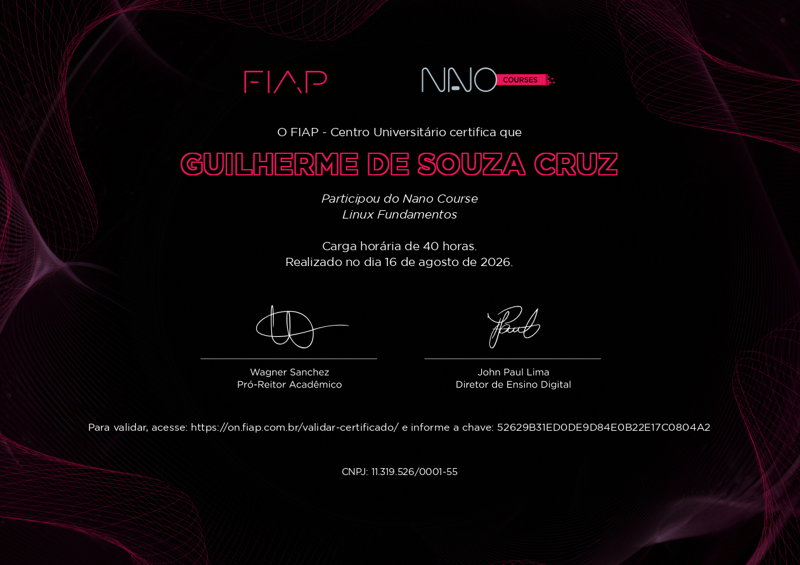

<h1 align="center">📝 Avaliação Oficial — Prova de Certificação: Linux Fundamentos</h1>

  <a href="../README.md">Home</a>
  &nbsp;&nbsp;&nbsp;|&nbsp;&nbsp;&nbsp;
  <a href="#-resultado">Resultado</a>
  &nbsp;&nbsp;&nbsp;|&nbsp;&nbsp;&nbsp;
  <a href="#-gabarito-comentado-20-questões">Gabarito</a>
  &nbsp;&nbsp;&nbsp;|&nbsp;&nbsp;&nbsp;
  <a href="README.md">Conteúdo</a>
  &nbsp;&nbsp;&nbsp;|&nbsp;&nbsp;&nbsp;
  <a href="#-certificado">Certificado</a>

## 📖 Sobre a avaliação

Registro **histórico** da prova de certificação oficial realizada na plataforma FIAP ON, com o gabarito comentado de todas as 20 questões. Este documento é preservado como comprovante de certificação — não deve ser confundido com o [`questionario.md`](questionario.md), que é uma avaliação autoral nova criada para fins de estudo.

## 🏆 Resultado

| Item | Valor |
|---|---|
| **Nota final** | 100,00 / 100,00 |
| **Status** | ✅ Certificação concluída |
| **Tentativas permitidas** | 2 |
| **Tempo limite** | 1h40min |
| **Data de envio** | Domingo, 16 de agosto de 2026 |
| **Período de disponibilidade** | 01/03/2020 a 31/12/2050 |

> *Certificado obtido com aproveitamento máximo na prova de certificação do curso Linux Fundamentos, oferecido pela FIAP ON.*

## 🖼️ Certificado

---

## ✅ Gabarito comentado (20 questões)

### 1. Colunas do `ls -l -a`
Associações sobre tipo/permissões, quantidade de arquivos, dono e grupo dono.  
**Resposta: c) Todas as afirmações estão corretas.**

### 2. Correntes (chains) do `iptables`
INPUT, OUTPUT e FORWARD e suas definições.  
**Resposta: c) Todas as regras estão corretas.**

### 3. Diretórios do sistema de arquivos Linux
`/bin`, `/` e `/home` — qual descrição pertence a qual diretório.  
**Resposta: d) As afirmações I e III estão corretas.**
*(A II está incorreta: "armazenar arquivos necessários para o boot" é responsabilidade do `/boot`, não do `/`.)*

### 4. Variedade do software livre
A grande variedade de opções em código aberto pode ser intimidadora para quem está começando.  
**Resposta: e) Iniciantes no ambiente Linux.**

### 5. Sintaxe do `grep`
Buscar a palavra "fiap" dentro do arquivo "aula.txt".  
**Resposta: d) grep fiap aula.txt**

### 6. Encerrar processo por PID
Finalizar processo de ID 2210.  
**Resposta: d) kill 2210**

### 7. Identificação de discos no Linux
Como HDD/SSD são tratados pelo sistema.  
**Resposta: b) Volume.**

### 8. Modos de operação do `vi`
Os dois modos fundamentais do editor.  
**Resposta: c) Modo de comandos e edição de texto.**

### 9. Trocar de usuário
Comando para se tornar outro usuário (ex.: root).  
**Resposta: d) O comando su**

### 10. Monitoramento de processos em tempo real
Comando que mostra total de processos, CPU, RAM e swap.  
**Resposta: c) top**

### 11. Listagem de processos
Comando geralmente usado com o parâmetro "-a".  
**Resposta: a) ps**

### 12. Configuração de interface de rede com `ifconfig`
Sintaxe correta para definir IP e máscara de sub-rede.  
**Resposta: c) ifconfig enp0s5 10.0.2.15 netmask 255.255.255.0**

### 13. Criar sistema de arquivos em uma partição
Comando para definir/criar um sistema de arquivos.  
**Resposta: d) mkfs**

### 14. Interação leve e rápida com o kernel
O que permite interagir com o kernel sem exigir placa gráfica potente ou muita RAM.  
**Resposta: b) O terminal de comandos.**

### 15. Criar novo usuário
Comando prático para criar um novo usuário no sistema.  
**Resposta: d) Comando useradd**

### 16. O que é gerado ao executar um programa
Resultado da execução de um programa armazenado em disco.  
**Resposta: e) Processo.**

### 17. Corrigir partição corrompida
Comando para verificar/corrigir sistema de arquivos antes da montagem.  
**Resposta: c) fsck /dev/sdb1**

### 18. Gerenciador dinâmico de dispositivos (plug and play)
Componente responsável pelo plug and play, referenciado em `/etc/udev/rules.d`.  
**Resposta: b) udev**

### 19. Montagem automática de partições na inicialização
O que fazer para que a montagem ocorra automaticamente após o boot.  
**Resposta: a) Inserir uma entrada com o comando no arquivo /etc/fstab.**

### 20. Alterar senha de usuário existente
Comando para modificar a senha de um usuário.  
**Resposta: b) Comando passwd**

---

## 📚 Referências

Gabarito fundamentado no material oficial dos três capítulos do curso:
- [Aula 01 — Introdução e Primeiros Comandos](aula-01/conteudo.md)
- [Aula 02 — Administração de Sistema e Editor de Texto](aula-02/conteudo.md)
- [Aula 03 — Recursos Avançados](aula-03/conteudo.md)

---

> *Este documento faz parte do repositório [`fiap-dev-journey`](https://github.com/https-shini/fiap-dev-journey), dedicado ao registro organizado dos materiais, resumos e avaliações dos cursos realizados na plataforma FIAP ON.*
